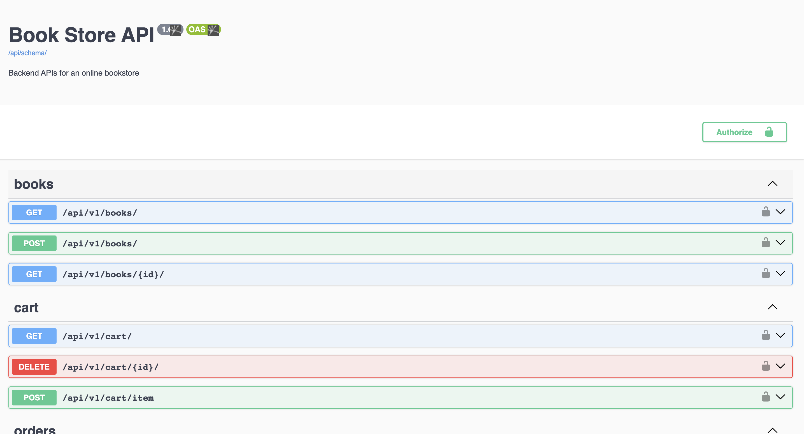
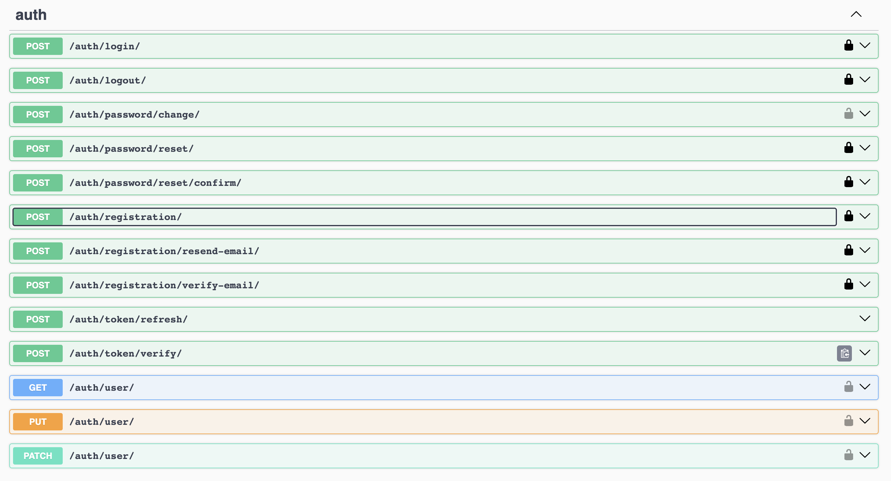

# imagine_book_store_api

Welcome to the **imagine_book_store_api**, a Django app that provides a comprehensive API for managing a bookstore. This app leverages the power of Django and several packages to offer features such as user registration and login, book browsing, shopping cart management, and order placement. Below, you'll find detailed information on how to set up and use this app.

## Getting Started

To access the deployed API, visit [Imagine Book Store API on Vercel](https://imagine-book-store-ivoay71ki-mtami.vercel.app/api/docs).

### Prerequisites

Before you can run the app locally or deploy it yourself, make sure you have the following prerequisites:

- Python (3.7 or higher)
- Django (3.0 or higher)
- Postgres DB (for production deployment)


for full third-parties library dependencies, check [requirements.txt](requirements.txt)
### Installation

1. Clone the repository:

   ```bash
   git clone https://github.com/mtami/imagine_book_store_api.git

2. Run the build script:

   ```bash
   sudo sh build.sh
   
 build.sh script will do the following actions:
> 1. Creating a virtual environment
> 2. Installing the project dependencies from requirements.txt
> 3. Apply databse migrations (the project will use sqlite by default)
> 4. Collecting static files


3. Run the project:

   ```bash
   sudo sh scripts/run-local.sh

4. The API should now be accessible locally at http://localhost:8000/api/docs.

### API Functionality

The Imagine Book Store API provides the following functionality:

* User registration and authentication using token-based authentication.
Browse and search for books.
* View book details by ID.
* Add and remove books from the shopping cart.
* View the shopping cart and place orders.
* Retrieve a list of previous orders.
* Secure endpoints that require authentication.

> Ensure to refer to the API documentation available at [Imagine Book Store API on Vercel](https://imagine-book-store-ivoay71ki-mtami.vercel.app/api/docs) for detailed information on available endpoints, request parameters, and responses.

### Missing Functionality
Right now, the password reset and email verification 
is not supported since this requires adding email provider service to the app.

## Screenshots





## Contributing
If you have any ideas, suggestions, or bug reports, please open an issue or submit a pull request.

